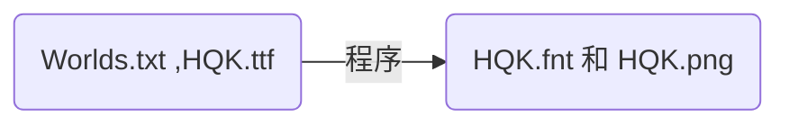

游戏开发，需要使用字体。

直接使用 TTF 字体，其优点是开发特别省事。

而缺点却是很要命：
1. TTF 字体文件过大，包含了不必要的字，增大了包体，减缓了加载速度；
2. 部分平台不支持 TTF 文件的加载；（笔者就曾遇到过这个问题：动态精简后的 ttf 文件，微信平台支持加载，在手 Q 平台和 Android 平台就不支持）；

为了解决全平台的字体加载问题，我们就不得不选择 `位图字体` 。

基于`使用位图字体`这个大前提下，来定制我们的 `解决方案`。

解决方案的核心问题用一句话描述就是：`如何从一个文本文件（包含所需的字符）出发，创建位图字体文件？`

# 解决方案
如果不想看原理，那么直接到最后的 `开源` 部分即可

## 1. 创建 `Words.txt` 用于 `存储文字`


特别注意的是：
> 保存格式为 UTF-8，我们在构建位图字体文件的过程中，会将所有字体收集到临时字体汇总文本（外界不需要关心）中，它的格式为  `UTF-16 LE` `CRLF`

## 2. 万事具备，只差`程序`


### 2.1 Windows 下的程序
核心思路是：利用 BMFont 软件来输出目标文件。
参考： [位图字体的制作与使用教程](https://cloud.tencent.com/developer/article/1754677) 

 1. 下载官方的 BMFont 软件 [Bitmap Font Generator(http://www.angelcode.com/products/bmfont/)](http://www.angelcode.com/products/bmfont/)


 2. 解压文件，将 bmfont1.14a 移动到`demo-build-font/build_bmfont`下


3. 按照参考教程生成配置`bmfont.bmfc`
 
 4. 编写 npm 包：
	```javascript
		 "use strict";
	var __importDefault = (this && this.__importDefault) || function (mod) {
	    return (mod && mod.__esModule) ? mod : { "default": mod };
	};
	Object.defineProperty(exports, "__esModule", { value: true });
	const child_process_1 = __importDefault(require("child_process"));
	const fs_extra_1 = __importDefault(require("fs-extra"));
	const minimist_1 = __importDefault(require("minimist"));
	const path_1 = __importDefault(require("path"));
	let argv = minimist_1.default(process.argv.slice(2));
	const srcPath = path_1.default.join(argv.src);
	const dstPath = path_1.default.join(argv.dst);
	const wordsTxtPath = path_1.default.join(srcPath, "Words.txt");
	const bmfcPath = path_1.default.join(srcPath, "bmfont.bmfc");
	const qhkFntPath = path_1.default.join(dstPath, "HQK.fnt");
	const allWordsTxtPath = path_1.default.join(dstPath, "AllWords.txt");
	const bmfont64exe = path_1.default.join(__dirname, "bmfont1.14a/bmfont64.exe");;
	
	console.log(">> build_bmfont >> Start");
	let callCmdSync = function (cmd, cwd) {
	    console.log(`---->> 在 ${cwd} 目录下执行指令 ${cmd} >>----`);
	    let result = '';
	    try {
	        result = child_process_1.default.execSync(cmd, { cwd: cwd, encoding: 'utf-8' });
	    }
	    catch (error) {
	        console.error(error);
	    }
	    console.log(result);
	    return result;
	};
	
	
	console.log(`---->> 读取动态字库文本 ${wordsTxtPath} >>----`);
	let wordsTxtStr = fs_extra_1.default.readFileSync(wordsTxtPath, { encoding: 'utf-8' });
	console.log(wordsTxtStr);
	/**
	 * 需要转成 utf16le，并且是 crlf 格式
	 * https://gist.github.com/zoellner/4af04a5a8b51f04ad653e26d3b7181ec
	 */
	console.log("---->> 动态将文本回写 >>----");
	const utf16buffer = Buffer.from(`\ufeff${wordsTxtStr}`, 'utf16le');
	fs_extra_1.default.writeFileSync(allWordsTxtPath, utf16buffer);
	
	callCmdSync(`${bmfont64exe} -t ${allWordsTxtPath} -c ${bmfcPath}  -o ${qhkFntPath}`, dstPath);
	
	console.log(">> build_bmfont >> End");
	```

4. 在 `build_bmfont` 文件夹下执行 `npm install` 初始化包
5. 双击执行 RunWindows.bat 将在 dst 下生成位图字体文件


## 开源
源码：[demo-build-font](https://github.com/zhenghuaxing/demo-build-font)

使用步骤：
1. 初始化环境
```sh
cd build_bmfont
npm install
```

2. 双击 RunWindows.bat 将在 dst 目录下生成位图字体。


## 参考
[Bitmap Font Generator](http://www.angelcode.com/products/bmfont/)
[位图字体的制作与使用](https://cloud.tencent.com/developer/article/1754677)
[write utf-16 encoded files in node.js (both utf16be and utf16le)](https://gist.github.com/zoellner/4af04a5a8b51f04ad653e26d3b7181ec)
